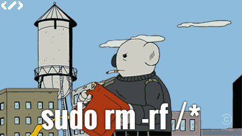
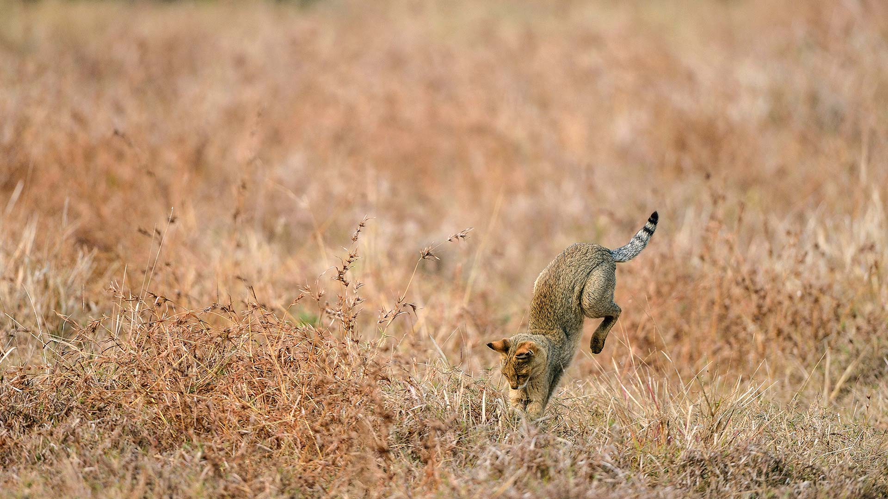

闲的蛋疼的产物,第一次构建hexo,主要为了方便以后查看和使用
<!-- more -->

## 生成新的post

```vb
hexo new [layout] <title>
```

其中layout可选择`post`,`page`,`draft`  
其他可以参考: https://hexo.io/docs/writing.html  

## 主页的简介

通过插入`<!-- more -->`  
可以让more标签位置之前的内容,显示文章在主页的简介中  

## 每次部署时

```vb
hexo clean
hexo g
hexo server

hexo deploy
```

- clean: 清空原来的缓存(public文件夹和database)
- g: 生成新的静态资源
- server: 部署在本地服务器,查看效果  
- deploy: 如果没问题了可以再部署在github上

可以三条语句直接复制,黏贴在git bash中连着执行  
我自己写了2个bat在项目根目录下方便本地测试和部署  
有些命令需要先安装插件,最后的参考中有完整的安装方法,因此这里略过  

## 关于插入图片

需要安装`hexo-asset-image`插件  
推荐使用0.0.5版本的,因为这样可以直接使用`文章的名称/xxx.jpg`来插入图片  

另外,这个theme好像不可以指定图片大小,或者点击放大  
太小的图不宜使用  
太大的图如果看不清需要另外右击查看

### 使用img标签插入

``


### 使用markdown的格式  

``


## 样式的一些小修改

### paginator.pug

这个主题的上一篇/下一篇的button做的太小,我修改了2个button的文字

### main.css

包含大部分页面的样式
- 我不太满意这个主题的行间距,感觉太挤了
- `<code>`标签像是没有着色一样,进行了修改
- 移动端下,链接长代码会因为保持同行而割裂中文,使用了`word-break:break-all`

## 测试一些语言

```java
//java
public static void main(String[] args){
  System.out.println("hello world");
}
```

```golang
//golang
fmt.println("hello world")
```

## 参考

如何部署: https://www.cnblogs.com/visugar/p/6821777.html  
theme: https://github.com/lyndonoc/hexo-theme-pandollo
layout.pug错误的解决办法: https://blog.csdn.net/weixin_44318830/article/details/104884936
主页生成摘要: https://blog.csdn.net/zhanghanlun/article/details/104312501
插入图片: https://blog.csdn.net/u010996565/article/details/89196612
图片不显示的问题: https://blog.csdn.net/Strong997/article/details/97767929
CSS中文换行的问题: https://www.cnblogs.com/zhang-wenbin/p/9717535.html
